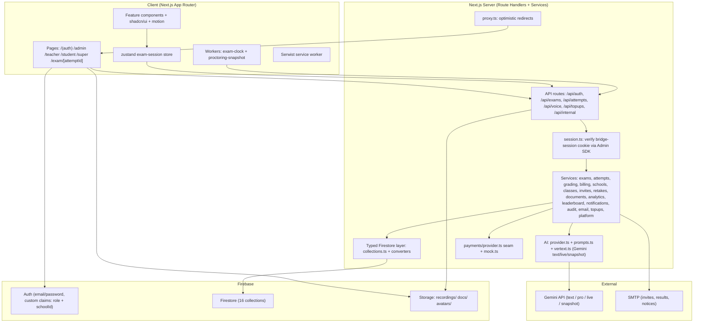
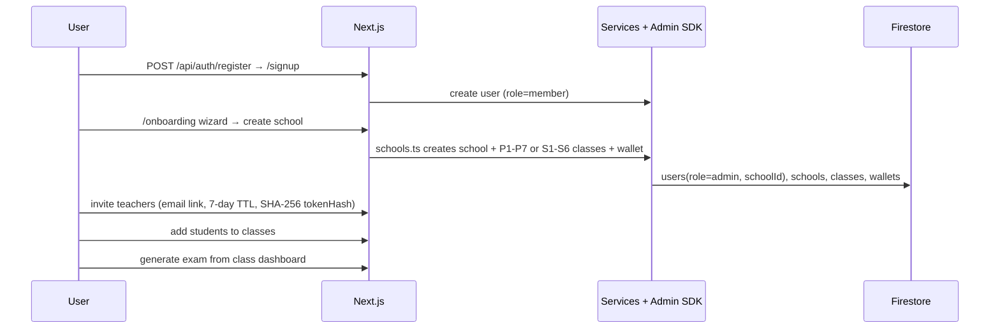
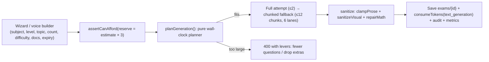
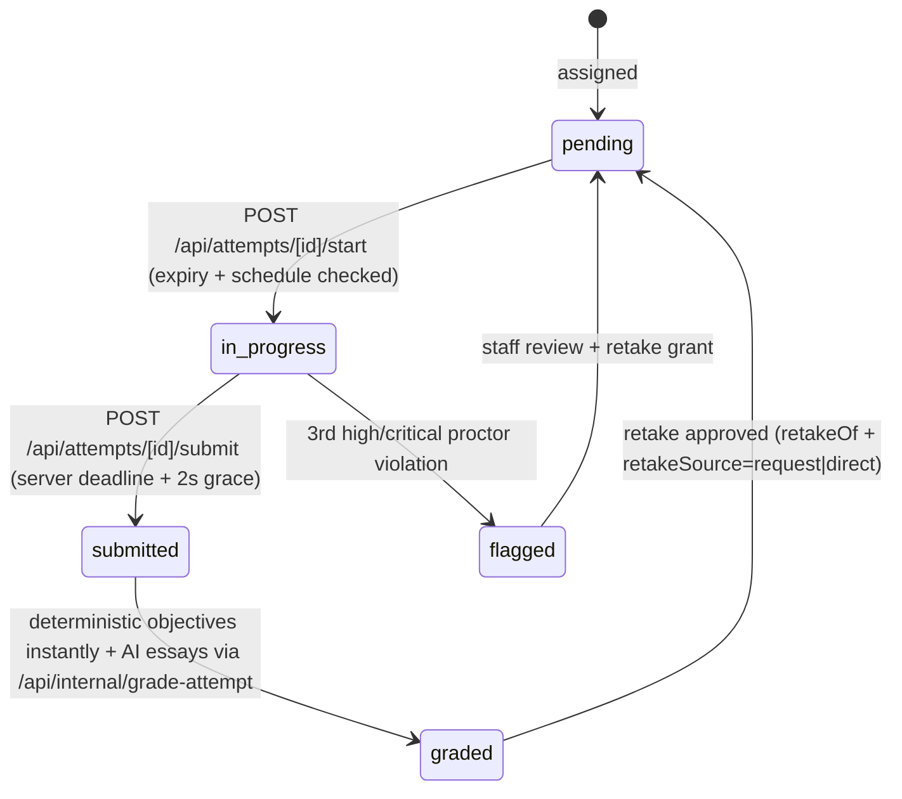
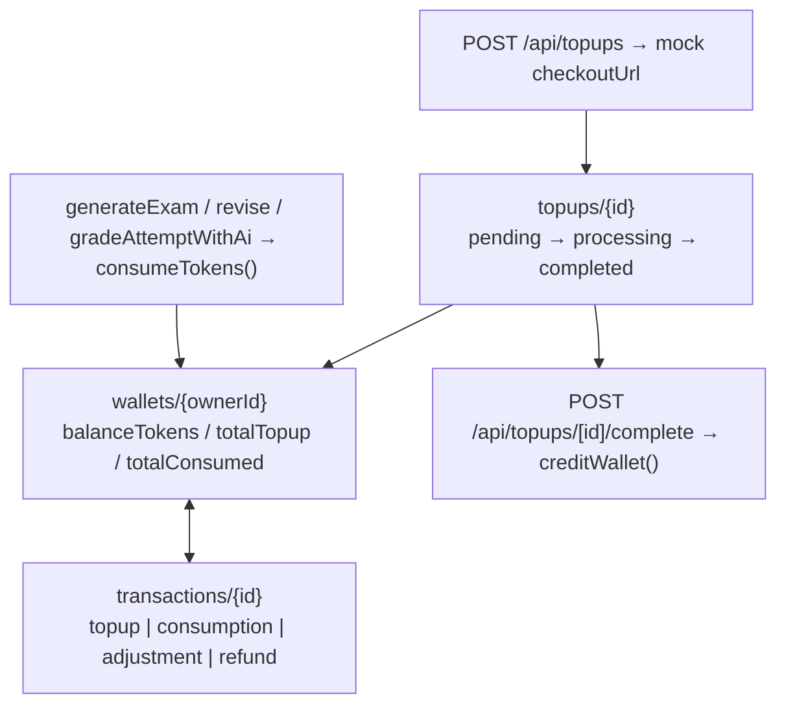
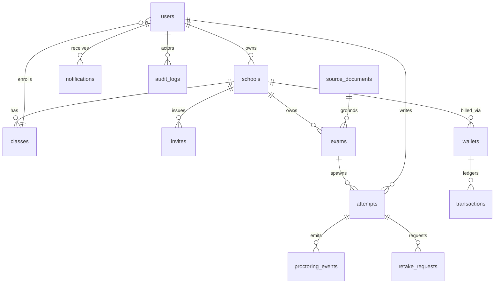

# Bridge — AI-Powered Assessment Platform

Bridge generates, proctors, and grades AI-powered exams for primary and
secondary school students (Ugandan curriculum first, expandable to other
countries), with instant personalized feedback and rich analytics for
teachers and platform administrators.

## Table of contents

- [Highlights](#highlights)
- [Tech stack](#tech-stack)
- [System architecture](#system-architecture)
- [How it works — key flows](#how-it-works--key-flows)
- [Project structure](#project-structure)
- [Routes](#routes)
- [API reference](#api-reference)
- [Data model (Firestore)](#data-model-firestore)
- [Roles & permissions](#roles--permissions)
- [AI exam pipeline](#ai-exam-pipeline)
- [Proctoring](#proctoring)
- [Billing](#billing)
- [Security](#security)
- [Getting started](#getting-started)
- [Scripts](#scripts)
- [Testing](#testing)
- [Deployment](#deployment)
- [Troubleshooting](#troubleshooting)

## Highlights

- **Self-serve school setup** — join as a normal user, create your school
  (primary **or** secondary — an exclusive choice that drives the standard
  class set: P1–P7 or S1–S6), and become its admin through a guided wizard.
- **Classes & teachers** — class entities with rosters and dashboards;
  teachers join via emailed, single-use invite links and manage the classes
  assigned to them (admins can create/assign classes and revoke invites).
- **AI exam generation** — configure subject, level, topic, duration,
  difficulty, question count, and question types; set a deadline/expiry, or
  upload past papers, textbooks, and notes (PDF/DOCX) as source material.
- **Exam review screen** — approve questions individually, AI-revise or
  hand-edit, assignment is gated until review is complete (or explicitly
  overridden).
- **Class dashboards & leaderboards** — per-class roster, ranked performance
  leaderboard (average + best score + trend), per-exam analytics, and
  one-click exam generation/assignment from the class page.
- **Retakes, two ways** — students request retakes as before, or staff grant
  one directly from results.
- **School verification (blue tick)** — schools add their registration
  details and request verification; a Super Admin grants the blue tick.
- **Voice-configured exams** — converse with a Gemini Live assistant that
  builds the exam spec through tool calling (`/admin/voice`).
- **AI-proctored exam sessions** — fullscreen distraction-free UI,
  server-authoritative timer, camera/microphone/screen recording
  (mediabunny), copy-paste and tab-switch detection, periodic AI snapshot
  analysis, and a fair two-warning anti-cheating policy.
- **Automatic grading & feedback** — objective questions scored instantly;
  essays graded against rubrics with per-question feedback and recommended
  improvement areas.
- **Five roles** — Super Admin (platform analytics, schools, verification,
  billing), Admin (school owner), Teacher (assigned classes), Student (take
  exams, view results, request retakes), Member (signed-up user who has not
  created a school yet).
- **Pay-as-you-go billing** — token wallets per school/admin with self-serve
  top-up checkout (a simulated gateway today; real providers plug into the
  same `PaymentProvider` seam later): `$0.027 / 1,000 text tokens`,
  `$0.08 / voice minute`, `1 USD = 3,800 UGX`.
- **Premium UI** — Tailwind v4 + shadcn/ui (Base UI primitives) with
  gradient/mesh backgrounds, layered shadows, and Framer Motion animations
  that respect `prefers-reduced-motion`.
- **PWA + offline** — `@serwist/next` service worker built automatically
  during `bun run build`.

## Tech stack

| Layer | Choice |
| ----- | ------ |
| Framework | Next.js 16 (App Router, Turbopack), React 19, TypeScript |
| Styling / UI | Tailwind CSS v4, shadcn/ui (`@base-ui/react`), `class-variance-authority`, `lucide-react`, `motion` (Framer Motion) |
| Forms / validation | `react-hook-form` + `@hookform/resolvers`, `zod` v4 |
| State | `zustand` (single `exam-session` store, deliberately not persisted) |
| Backend / data | Firebase Auth, Firestore (typed access layer), Storage, Admin SDK (`firebase-admin`) |
| AI | Vercel AI SDK v7 (`ai` + `@ai-sdk/google` + `@ai-sdk/google-vertex`), Gemini models (see [AI exam pipeline](#ai-exam-pipeline)) |
| Exam media | `mediabunny` (WebM camera/screen recording), Web Workers for clock + snapshots |
| Content | `react-markdown` + `remark-math`/`rehype-katex` + `katex`, `mammoth` (DOCX), `pdf-parse` |
| Reports / email | `@react-pdf/renderer`, `@react-email/*` + `nodemailer` (SMTP) |
| PWA | `@serwist/next` + `@serwist/cli` |
| Tests | Vitest (unit) + Playwright (e2e) |
| Tooling | `bun@1.4.0`, ESLint (`eslint-config-next`), `tsx`-style scripts in `scripts/` |

> This repo pins `next@16.3.2`. Per `AGENTS.md`, this is **not** the
> Next.js you know — APIs and conventions may differ from training data.
> Read `node_modules/next/dist/docs/` before writing framework code.

## System architecture



Clean layering enforced by convention:

```
UI (app/ + components/) → server services (auth guards, billing, AI)
→ typed Firestore access layer (collections.ts) → Firestore
```

All document access goes through converters in
`src/server/firebase/collections.ts` for compile-time type safety.
Never call `.collection()` / `.doc()` directly. `stripUndefined`
guards writes because Firestore rejects `undefined`.

## How it works — key flows

### 1. Onboarding → first exam



First-run bootstrap options:

1. Visit `/signup` to join as a normal user, then follow the onboarding
   wizard to create your school (you become its admin).
2. Or visit `/setup` and paste your `SETUP_ADMIN_KEY` to create the Super
   Admin account, then create schools and admins from `/super/schools`.
3. Invite teachers (email link), add students to classes, and generate your
   first exam from a class dashboard.

`scripts/backfill-directory-retake-fields.ts` backfills school
`level`/verification fields, creates the standard class set per school,
assigns existing students to matching classes, and seeds `expiresAt` on
old exams. It is idempotent.

### 2. Exam generation (metered, budgeted)



See [AI exam pipeline](#ai-exam-pipeline) for budgets, caps, and model IDs.

### 3. Attempt lifecycle + grading



Submit is transactional with an `in_progress` guard so a concurrent
proctoring termination always wins over a late manual submit.

### 4. Billing (pay-as-you-go wallets)



Wallet id = `schoolId` for school members, else the user's own uid
(standalone admins). Every debit/credit is an atomic Firestore
transaction that also appends a ledger row.

## Project structure

```
src/
  app/          # routes (auth, dashboards, exam runner, api handlers)
    (auth)/     # login, signup, setup, onboarding, invite/[token]
    admin/      # school admin: dashboard, classes, exams, generate, voice, students, teachers, requests, wallet, school
    teacher/    # teacher: classes, exams, generate, students, requests, wallet
    student/    # student: dashboard, exams, results
    super/      # platform: dashboard, schools, teachers, students, wallets, audit
    exam/[attemptId]/  # fullscreen proctored runner
    wallet/checkout/[topupId]/  # mock checkout page
    notifications/ dashboard/ banned/ suspended/
    api/        # route handlers (see API reference)
  components/
    ui/         # ~38 shadcn primitives (button, dialog, card, chart, sidebar, ...)
    motion/     # Framer Motion variants + helpers (reduced-motion aware)
    features/   # domain UI: admin(11), auth(6), dashboard(2), exam(3),
                #   notifications(2), school(11), student(2), super(9)
    markdown.tsx  providers.tsx  service-worker-registrar.tsx
  lib/          # client-safe: firebase, constants, schemas, utils, pricing
    constants.ts  pricing.ts  pagination.ts  leaderboard.ts
    serialize.ts  user-agent.ts  utils.ts  vertext.ts
    exam/       # answers, expiry, latex, media-streams, recording, review
    schemas/    # zod: auth, attempt, exam, exam-review, school, users
    firebase/   # client.ts (web SDK), notifications.ts
  server/       # server-only: admin SDK, typed Firestore layer, services, AI
    auth/session.ts
    firebase/admin.ts  firebase/collections.ts
    ai/provider.ts  ai/prompts.ts
    services/   # analytics, attempts, audit, billing, classes, documents,
                #   email, exam-review, exams, grading, invites, leaderboard,
                #   notifications, payments/{provider,mock}, platform,
                #   reports.tsx, retakes, schools, topups, users
  stores/       # zustand: exam-session.ts (answers, current, flagged, warnings, phase)
  types/        # shared domain + Firestore document types (firestore.ts)
  workers/      # exam-clock.worker.ts, proctoring-snapshot.worker.ts
  emails/       # react-email templates
  proxy.ts      # optimistic route protection (cookie presence only)

e2e/tests/      # Playwright specs (smoke, console)
tests/unit/     # 18 Vitest suites (pricing, grading, schemas, proctoring, ...)
scripts/        # backfill-directory-retake-fields, fix-env-key, integration-test, repair-onboarded-admin
public/         # PWA manifest, icons, offline page
firebase.json  firestore.rules  firestore.indexes.json  storage.rules
next.config.ts  serwist.config.js  components.json  vitest.config.ts  playwright.config.ts
```

Architecture follows clean layering: UI → server services (auth guards,
billing, AI) → typed Firestore access layer. All document access goes
through converters in `src/server/firebase/collections.ts` for compile-time
type safety.

## Routes

### Public / auth

| Route | Purpose |
| ----- | ------- |
| `/` | Marketing landing |
| `/login`, `/signup` | Email/password auth (sets `bridge-session` httpOnly cookie) |
| `/setup` | One-time Super Admin bootstrap (gated by `SETUP_ADMIN_KEY`) |
| `/onboarding` | School-creation wizard (member → admin) |
| `/invite/[token]` | Accept single-use teacher invite |
| `/banned`, `/suspended` | Moderation states |

### Staff (admin + teacher share most; teachers scoped to assigned classes)

| Route | Purpose |
| ----- | ------- |
| `/admin`, `/teacher`, `/dashboard` | Role dashboards (router sends each role home) |
| `/admin/classes`, `/admin/classes/[classId]` | Class list + dashboard (roster, leaderboard, analytics, generate) |
| `/admin/exams`, `/admin/exams/[examId]`, `/admin/exams/[examId]/review` | Library, detail + assign, question review/approve/revise |
| `/admin/generate`, `/admin/voice` | Form wizard + Gemini Live voice builder |
| `/admin/students`, `/admin/teachers`, `/admin/requests` | Roster, invites, retake queue |
| `/admin/school`, `/admin/wallet` | Profile + verification request, token wallet + top-ups |
| Teacher mirrors | `/teacher/classes…`, `/teacher/exams…`, `/teacher/generate`, `/teacher/students`, `/teacher/requests`, `/teacher/wallet` |

### Student

| Route | Purpose |
| ----- | ------- |
| `/student`, `/student/exams`, `/student/exams/[examId]` | Dashboard, assigned list, pre-start detail |
| `/exam/[attemptId]` | Fullscreen proctored runner (onboarding → exam → terminated) |
| `/student/results`, `/student/results/[attemptId]` | Results list + per-question feedback, PDF export |
| `/notifications` | In-app notification inbox |

### Platform (Super Admin)

`/super` (analytics) · `/super/schools`, `/super/schools/[schoolId]` ·
`/super/teachers`, `/super/teachers/[teacherId]` ·
`/super/students`, `/super/students/[studentId]` ·
`/super/wallets` (manual top-ups) · `/super/audit` (audit log)

### Checkout

`/wallet/checkout/[topupId]` — mock hosted checkout (real providers plug
into `PaymentProvider` later).

## API reference

All mutations flow through server APIs — direct client writes are denied
by security rules. Auth = `bridge-session` cookie verified per request
with the Admin SDK.

| Method + path | Service | Notes |
| ------------- | ------- | ----- |
| `POST /api/auth/register` | `users` | Create member |
| `POST /api/auth/session` | `auth/session` | Exchange ID token → httpOnly cookie |
| `POST /api/setup` | `platform` | First Super Admin (key-gated, one-time) |
| `POST /api/exams/generate` | `exams.generateExam` | Pre-flight billing + `planGeneration` budget gate, `maxDuration=180` |
| `GET/PATCH /api/exams/[examId]` | `exams` | Detail, assign, archive |
| `POST /api/exams/[examId]/revise` | `exam-review` | AI question revision (4× reserve) |
| `GET/POST /api/documents` | `documents` | Upload PDF/DOCX/TXT → Storage `docs/` → parse (`pdf-parse`/`mammoth`) |
| `POST /api/attempts/[attemptId]/start` | `attempts.startAttempt` | Expiry + schedule window, returns safe questions (no answers) |
| `POST /api/attempts/[attemptId]/submit` | `attempts.submitAttempt` | Server deadline, deterministic objective grading |
| `POST /api/attempts/[attemptId]/proctor` | `attempts.logProctorEvent` | Two-warning policy, may `terminate` |
| `POST /api/attempts/[attemptId]/snapshot` | AI snapshot | Periodic camera-frame analysis (snapshot model) |
| `POST /api/attempts/[attemptId]/recording` | `attempts.attachRecordings` | Attach `recordings/` WebM paths |
| `POST /api/invites/accept` | `invites` | Hash-compare single-use token, create teacher |
| `POST /api/topups`, `POST /api/topups/[topupId]/complete`, `.../cancel` | `topups` + `billing` | Mock checkout → `creditWallet()` ledger |
| `POST /api/voice/setup`, `POST /api/voice/complete` | voice builder | Live session → exam spec via tool calling |
| `GET /api/reports/attempt/[attemptId]` | `reports.tsx` | PDF result report (`@react-pdf/renderer`) |
| `POST /api/internal/grade-attempt` | `grading.gradeAttemptWithAi` | Essay grading (guarded by `INTERNAL_API_SECRET`) |

## Data model (Firestore)

Single source of truth: `src/types/firestore.ts`. Typed accessors:
`src/server/firebase/collections.ts`.



| Collection | Key fields |
| ---------- | ---------- |
| `users` | `email, displayName(+Lower), role, schoolId, status, classLevel, level, secondarySubLevel, classId, assignedClassIds, banReason, suspendedUntil` |
| `schools` | `name(+Lower), ownerUid, country(UG), level(primary\|secondary), verification(unverified\|pending\|verified), registrationNumber, counts` |
| `classes` | `schoolId, level, classLevel(1-7 / 1-6), secondarySubLevel, name, teacherIds[], studentCount` |
| `invites` | `schoolId, email, role=teacher, classIds[], status, tokenHash(SHA-256), expiresAt(7d)` |
| `exams` | `title, params(ExamParams), questions[Question], sourceType(params\|documents), status(draft\|scheduled\|active\|archived), classId, expiresAt, usage{generation,grading,revision}, review{approvedIds[], revisedCount}` |
| `attempts` | `examId, studentId, schoolId, status(pending\|in_progress\|submitted\|graded\|flagged), answers[AttemptAnswer], score, feedback, violationsCount, warningsIssued, recordings, retakeOf, retakeSource` |
| `proctoring_events` | `attemptId, examId, studentId, type(14), severity, details, aiVerdict` |
| `retake_requests` | `attemptId, examId, studentId, reason, status(pending\|approved\|rejected)` |
| `wallets` | `ownerId, ownerType(admin\|school), balanceTokens, totals` |
| `transactions` | `walletId, type(topup\|consumption\|adjustment\|refund), category, tokensDelta, balanceAfter, usdMicros, ugx` |
| `topups` | `walletId, tokens, amountUsdMicros, amountUgx, status, provider(mock), checkoutUrl` |
| `source_documents` | `ownerId, storagePath, parseStatus, parsedText, pageCount` |
| `notifications` | `userId, type(6), title, body, link, read` |
| `audit_logs` | `actorId, actorRole, action, targetType/Id, meta, ip` |
| `metrics` | `metrics/daily/{yyyy-mm-dd}` aggregates for analytics |
| `platform` | `platform/flags` singleton (`setupCompleted`) |

Question types: `multiple_choice, true_false, fill_in_the_blank,
short_answer, essay, matching`. Questions support Markdown + `$…$` math,
hints, explanations, worked examples, and visuals (`chart(bar|line|pie|area)`
or `table` — rows wrapped as `{cells[]}` because Firestore rejects nested
arrays).

Indexes: ~35 composite indexes in `firestore.indexes.json` (users by
role+school+created, attempts by student/exam/school, exams by
school+class, notifications by user+read, etc.). Deploy with
`bun run firebase-deploy`.

## Roles & permissions

| Capability | super_admin | admin | teacher | student | member |
| ---------- | ----------- | ----- | ------- | ------- | ------ |
| Platform analytics, schools, verification, wallets | ✅ | — | — | — | — |
| Create school (onboarding) | — | ✅ (owner) | — | — | ✅ |
| Manage classes / students / invites | — | ✅ all | ✅ assigned only | — | — |
| Generate / revise / assign exams | — | ✅ | ✅ (from assigned class) | — | — |
| Take exams, request retakes | — | — | — | ✅ | — |
| Grant retakes directly | — | ✅ | ✅ | — | — |
| Top up wallet | ✅ (manual) | ✅ (self-serve) | ✅ (school wallet) | — | — |

Enforcement is dual-layer: Firebase custom claims (`role` + `schoolId`)
checked in `firestore.rules` / `storage.rules` **and** in the server
data-access layer (`src/server/auth/session.ts`). `proxy.ts` only does
cheap optimistic redirects on cookie presence.

## AI exam pipeline

Models (env-overridable, defaults in `.env.example`):

| Purpose | Default | Env |
| ------- | ------- | --- |
| Generation + grading | `gemini-3.7-flash` | `BRIDGE_MODEL_TEXT` |
| Retry escalation (same speed class — Pro aborts the slice) | `gemini-3.7-flash` | `BRIDGE_MODEL_TEXT_PRO` |
| Voice builder (must support Live API) | `gemini-live-2.5-flash-native-audio` | `BRIDGE_MODEL_LIVE` |
| Proctor snapshots | `gemini-3.5-flash-lite` | `BRIDGE_MODEL_SNAPSHOT` |

Key design decisions (see comments in `src/server/services/exams.ts`):

- **Pure pre-planner** — `planGeneration()` decides up front whether an
  exam fits: budget `150s` total, `12s` save reserve, max `12` chunks,
  min `5` questions/chunk, `6` concurrent lanes, max `2` full attempts.
  Oversized exams fail fast (400) with actionable levers instead of a 504.
- **Throughput-calibrated** — slices sized from ~150 structured-output
  tok/s measured on real `gemini-3.7-flash` round trips; per-question cost
  scales with extras (hints +60, explanations +110, worked examples +160)
  and difficulty (easy 0.85× → very_hard 1.25×).
- **Thinking pinned** — Gemini 3.x floors at `thinkingLevel: "low"`
  (cannot be off); 2.5 uses `thinkingBudget: 0`. See `thinkingOptions()`.
- **No constrained decoding** — `structuredOutputs: false` + explicit
  prompt envelope + client-side `Output.object` validation. The grammar
  mode sent long free-form fields into repetition loops.
- **Generous output caps** — `OUTPUT_CAP_HEADROOM=4×` estimate + 2k
  scaffolding; billing is per-token-produced so an unreached cap is free,
  while a too-low cap loses the whole round trip.
- **Sanitization** — `clampProse` (repetition-cut + 1,200 chars) →
  `repairMath`, `sanitizeVisual` (12 rows / 8 headers / 100-char cells /
  4k JSON cap). A dropped visual is a warning, never a failure.
- **Grading split** — objectives graded deterministically in
  `attempts.ts` (`gradeOne`); essays via `grading.ts` (temp 0.3, capped
  tokens, billed to exam owner's wallet, student notified by email +
  in-app).

## Proctoring

- Detectors: `tab_switch, window_blur, fullscreen_exit, copy_attempt,
  paste_attempt, context_menu, devtools_shortcut, typing_pause,
  multiple_faces, no_face, phone_detected, suspicious_activity, ai_flag`.
- Severity: `info | low | medium | high | critical`. Only
  `high`/`critical` count as violations.
- Policy (`PROCTORING` in `constants.ts`): snapshot every `30s`, warn
  after 1st violation, terminate + `flagged` on 3rd (`maxWarnings: 2`).
- Client: `exam-runner` + `exam-clock.worker` (server-authoritative
  deadline) + `proctoring-snapshot.worker`; recordings via `mediabunny`
  (WebM, ≤500 MB) to `recordings/{uid}/{attemptId}/`; snapshot frames to
  `/api/attempts/[id]/snapshot` for AI verdicts.
- Server: `logProctorEvent` runs in a Firestore transaction so concurrent
  tab-switch bursts can't lose counts and a termination always beats a
  racing submit.

## Billing

Pure math lives in `src/lib/pricing.ts` (unit-tested, integer
micro-dollars to avoid float drift).

| Constant | Value |
| -------- | ----- |
| `ugxPerUsd` | 3,800 |
| `usdPer1kTextTokens` | $0.027 → 27 micros/token |
| `usdPerVoiceMinute` | $0.08 |
| Top-up packs | 100k Starter, 500k Class, 2M School, 10M District |

Estimates (pre-flight only; actual usage billed after the fact):

| Operation | Estimate | Reserve required |
| --------- | -------- | ---------------- |
| Generation | `700 × q + (6000 if docs else 1200)` | `×3` |
| Revision | `1200 × q + 1500` | `×4` |
| Grading | `500 × q + 800` | exact |

`assertCanAfford` fails fast with 402; `consumeTokens`/`creditWallet`
are atomic transactions that append to `transactions` and fold revenue
into `metrics/daily`.

## Security

- Role-based access via Firebase custom claims, enforced in Firestore/
  Storage rules **and** the server data-access layer.
- Session ID tokens delivered as httpOnly cookies (`bridge-session`),
  verified per request with the Admin SDK.
- Deny-by-default rules: all client writes denied except marking own
  notifications read and narrow profile edits; every mutation flows
  through audited server APIs.
- Storage: `recordings/` (owner-write WebM-only, admin/super read),
  `docs/` (admin-owner PDF/DOCX/TXT ≤50 MB), `avatars/` (self-write
  images ≤5 MB, public read).
- Audit logging for sensitive actions; rate limiting on AI endpoints.
- `proxy.ts` performs optimistic redirects; authoritative checks always
  happen server-side next to the data.
- `next.config.ts` ships `X-Frame-Options: SAMEORIGIN`,
  `nosniff`, strict referrer policy, camera/mic/display-capture
  permissions policy, and `no-cache` for the service worker.

## Getting started

```bash
bun install
cp .env.example .env.local   # fill in Firebase + Gemini keys
bun run dev                  # http://localhost:3000
```

Required environment variables are documented in [`.env.example`](./.env.example):

| Var | Purpose |
| --- | ------- |
| `NEXT_PUBLIC_FIREBASE_*` (6) | Firebase web config |
| `FIREBASE_SERVICE_ACCOUNT_KEY` | Admin SDK key (single-line, quoted-multiline, or base64; or `FIREBASE_PROJECT_ID` + `FIREBASE_CLIENT_EMAIL` + `FIREBASE_PRIVATE_KEY`) |
| `GOOGLE_GENERATIVE_AI_API_KEY` | Gemini API key |
| `BRIDGE_MODEL_TEXT / _PRO / _LIVE / _SNAPSHOT` | Model overrides |
| `NEXT_PUBLIC_APP_URL` | Canonical URL (emails, PWA manifest) |
| `SETUP_ADMIN_KEY` | Secret for one-time `/setup` Super Admin creation |
| `INTERNAL_API_SECRET` | Guards `/api/internal/*` (`x-internal-secret`) |
| `SMTP_HOST/PORT/USER/PASSWORD`, `EMAIL_FROM` | Email notifications |
| `NEXT_PUBLIC_USE_FIREBASE_EMULATORS`, `FIREBASE_EMULATOR_HOST` | Local emulators |

### Local emulators (optional)

```bash
npx -y firebase-tools@latest emulators:start
# then set NEXT_PUBLIC_USE_FIREBASE_EMULATORS=true in .env.local
```

Ports: Auth `9099`, Firestore `8080`, Storage `9199`, UI `4000`
(`singleProjectMode: true`).

### First-run bootstrap

1. Visit `/signup` to join as a normal user, then follow the onboarding
   wizard to create your school (you become its admin).
2. Or visit `/setup` and paste your `SETUP_ADMIN_KEY` to create the Super
   Admin account, then create schools and admins from `/super/schools`.
3. Invite teachers (email link), add students to classes, and generate your
   first exam from a class dashboard.

`/setup` only creates the first Super Admin and marks initial setup complete;
it does not migrate existing data.

### Existing-environment migration

Before deploying queries that depend on the directory and retake fields, run
the idempotent backfill once in each existing environment:

```bash
bun --env-file=.env.local scripts/backfill-directory-retake-fields.ts
```

The command backfills school `level`/verification fields, creates the standard
class set per school, assigns existing students to matching classes, and seeds
`expiresAt` on old exams.

Scripts in `scripts/`: `backfill-directory-retake-fields.ts`,
`repair-onboarded-admin.ts`, `fix-env-key.ts`, `integration-test.ts`
(run with `bun scripts/<name>.ts`).

## Scripts

| Script | Purpose |
| ------ | ------- |
| `bun run dev` | Start the dev server (Turbopack) |
| `bun run build` | Production build + service worker (`next build && serwist build`) |
| `bun run start` | Serve the production build |
| `bun run lint` | ESLint |
| `bun run typecheck` | TypeScript, no emit |
| `bun run test` | Vitest unit tests |
| `bun run test:watch` / `test:coverage` | Watch / V8 coverage |
| `bun run e2e` | Playwright end-to-end tests |
| `bun run firebase-deploy` | Deploy `firestore:rules, firestore:indexes, storage` |

## Testing

- **Unit (Vitest)** — pricing/billing math, grading logic, zod schemas,
  proctoring policy, typed collection helpers. 18 suites in `tests/unit`:
  `pricing, grading, schemas, school-schemas, proctoring, leaderboard,
  pagination, serialize, topups, invite-tokens, exam-{plan,ai-errors,
  prose,latex,expiry,answers,visuals,review}`. Config: `vitest.config.ts`.
- **E2E (Playwright)** — critical paths: setup/login, student exam flow
  (with fake media streams), admin generation. Specs in `e2e/tests`
  (`smoke`, `console`); config `playwright.config.ts` with
  `test-results/` output.

```bash
bun run test
bun run e2e
```

## Deployment

Any Node 22+ host or Vercel. Set the same environment variables; the
service worker is built automatically during `bun run build`.

Checklist:

1. `bun run lint && bun run typecheck && bun run test && bun run build`
2. `bun run firebase-deploy` (rules + indexes + storage)
3. Set prod env vars (`NEXT_PUBLIC_APP_URL`, Firebase, Gemini, SMTP,
   `SETUP_ADMIN_KEY`, `INTERNAL_API_SECRET`)
4. Warm `/setup` once, then disable/rotate the key

## Troubleshooting

| Symptom | Likely cause |
| ------- | ------------ |
| `GOOGLE_GENERATIVE_AI_API_KEY is not set` | Missing Gemini key in `.env.local` |
| `Not enough tokens (402)` | Wallet below `reserveForGeneration` — top up in `/admin/wallet` or `/super/wallets` |
| `This exam is too large (400)` | Over `planGeneration` budget — fewer questions or drop worked examples/explanations/hints |
| `Generation ran out of time (504)` | Transient overload — retry with a smaller exam |
| `Start the exam before submitting (409)` | Attempt still `pending` — hit `start` first |
| `This attempt was flagged (403)` | 3rd proctor violation — staff must grant a retake |
| Raw multiline service-account paste fails | Wrap in single quotes, single-line it, or base64-encode per `.env.example` |
| Missing composite index errors | Run `bun run firebase-deploy` |
